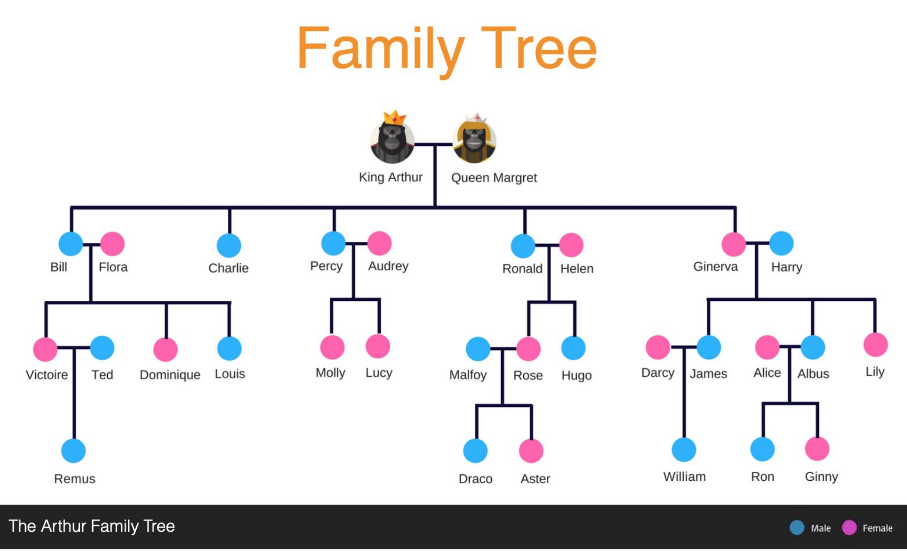

# Welcome to the BloodLine application.


## TLDR:

The application takes input in form of a text file that needs to be given via command line. The
output will be printed over the console.

### Running it on local
Assumptions:
1. You have mvn or an IDE that supports it.
2. You have already run mvn commands to generate the target folder

You just need to do a
```
java -jar target/bloodline.jar
```
And Voila!, the code has generated the output.

## Longer Version:

1. The app creates the family tree on its own and takes test input in form of a text file. 
2. A thorough use of dependency injections can be witnessed across the classes 
3. We have log statements to analyze the code better
4. We have unit tests too to ensure robustness and less bug-prone code
5. Comments have been added where necessary

#### The app is different because
1. There is no requirement that a spouse/family member need to be of a specific gender
2. We support 11 genders for now. The spouse field is an optional map for this very reason. 

It's a free world. This app lets you experience just that!

#### Understanding the folder structure:

Our classes are inside src/main/java/com.family.tree folder and follows the following:

_enums_ : All the java enums used in the project are under this repository

_io_ : Files responsible for parsing our input and processing the output are  here

_util_ : This has utility classes like constants, member and stream utilities etc. 

_model_ : Our domain model i.e the basic family member structure is here

_service_ : Currently we have six services along with their implementations. The services are basically interfaces and their implementations are the classes implementing them.

1. _FamilyTreeService_ :
    This service is responsible for orchestrating different actions. 
    This is what the constructor looks like:
     ```
        FamilyTreeService(List<String[]> actionList, MemberService memberService)
     ```
   It consists of a single public method whose job is to delegate the actions to MemberService

2. _MemberService_ : This is an interface that has the needed contracts . It has two methods => for adding a child and getting the relationship.
3. _InLawService_ : A service to get all inLaw relationships 
4. _ExtendedRelationService_ : A service to get all extended relations
5. _MemberServiceImpl_ : This forms the core of our application. This implements the MemberService discussed above
    This is what the constructor method looks like:
    ```
    MemberService(LinkedHashMap<Map<String, Gender>, Member> lookup, InLawService inLawService, ExtendedRelationService extendedRelationService)   
    ```
    It has two overridden method for adding a child and getting the relationship.
    
6. _FamilyLookupService_ : This intelligently stores your  family tree to a faster 
     map. The benefit of storing the values in a lookup is, in the future if the family grows exponentially, and we need to locate the deepest child , this lookup would then come in handy :)
     The constructor method accepts the root node of the tree.
```
    FamilyLookupService(Member root_KingArthur) 
```   

-----------------------------------------------------------------------

#### Understanding the flow:

_Bloodline.java_ class is the entry point of our application that consists the main method.
This class is responsible for all the dependency injections of our services. It boots up all the underlying classes too.
The main method injects InLawService and ExtendedRelationService into MemberService and in turn injects MemberService into FamilyTree


